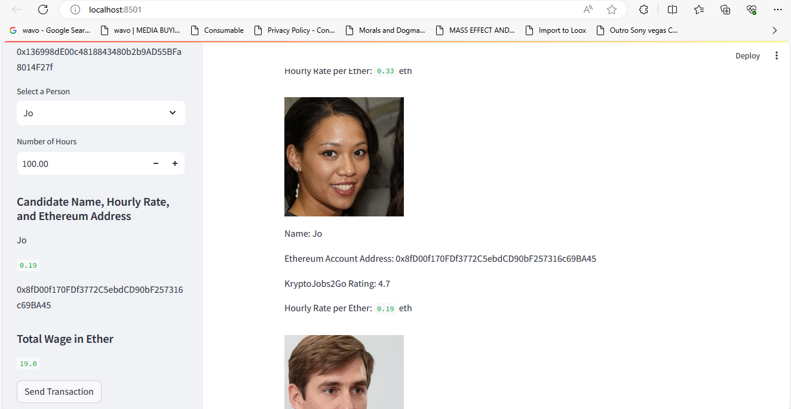
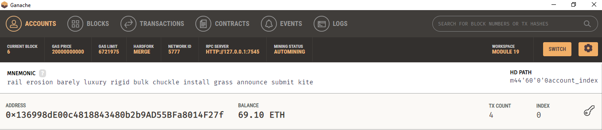
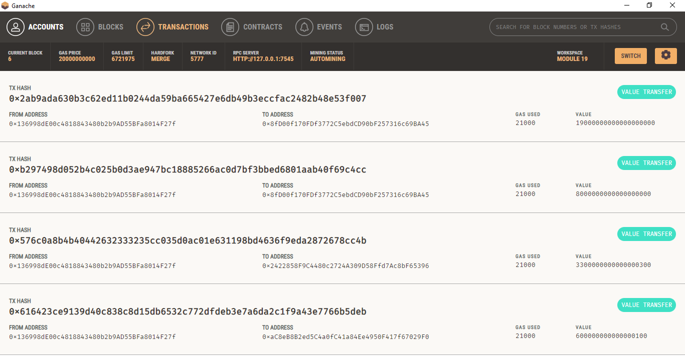

# Cryptocurrency Wallet

### Background

In this challenge I work at a startup that is building a new and disruptive platform called KryptoJobs2Go. KryptoJobs2Go is an application that its customers can use to find fintech professionals from among a list of candidates, hire them, and pay them. As KryptoJobs2Go’s lead developer, I have been tasked with integrating the Ethereum blockchain network into the application in order to enable customers to instantly pay the fintech professionals whom they hire with cryptocurrency.

To complete this Challenge, I used two Python files, both of which are contained in the starter folder.

The first file that you will is called `krypto_jobs.py`. It contains the code associated with the web interface of the application. The code included in this file is compatible with the Streamlit library.

The second file that I used is called `crypto_wallet.py`. This file contains the Ethereum transaction functions that I created. By using import statements, I integrated the `crypto_wallet.py` Python script into the KryptoJobs2Go interface program that is found in the `krypto_jobs.py` file.

### Steps

The steps for this challenge are broken out into the following sections:

* Import Ethereum Transaction Functions into the KryptoJobs2Go Application
* Sign and Execute a Payment Transaction
* Inspect the Transaction on Ganache.

### Results 

